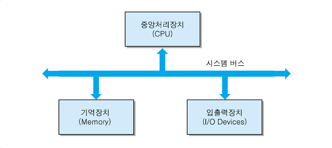

## **컴퓨터의 기본 구조**

**컴퓨터의 구조**는 중앙처리장치, 기억장치, 입출력장치로 구성되어 있다. **중앙처리장치(CPU)**는 "프로그램 실행"과 "데이터 처리"라는 중추적인 기능의 수행을 담당하며 컴퓨터의 특성과 성능에 가장 큰 영향을 미친다. 즉, CPU가 없으면 컴퓨터는 작동하지 않는다.

CPU가 처리하는 프로그램과 그 데이터들은 기억장치에 저장되는데, 특성과 속도 및 용량에 따라 주기억장치와 보조기억장치로 분류된다.

입출력장치는 입력장치와 출력장치를 통칭하는 용어로서, CPU가 장치 제어기를 통해 입출력장치의 동작을 제어한다.

## **정보의 표현과 저장**

1. **기계어**
   - 컴퓨터 하드웨어 부품들이 이해할 수 있는 언어로서, 2진 비트들로 구성
2. **어셈블리어**
   - 고급 언어와 기계어 사이의 중간 언어
3. **고급 언어**
   - 영문자와 숫자로 구성되어 사람이 이해하기 쉬운 언어(ex. Java, Python, C/C++ 등)
   - 컴파일러를 이용하여 기계어로 번역

### **기계 명령어의 형식**

| 연산코드 | 오퍼랜드 |
| -------- | -------- |
| 001      | 00101    |

1. **연산코드**
   - CPU가 수행할 연산을 지정해 주는 비트
2. **오퍼랜드**
   - 연산에 사용될 데이터 및 그것이 저장되어 있는 기억장치 주소

## **시스템의 구성**

### **CPU와 기억장치의 접속**

- #### **시스템 버스**

  - CPU와 시스템 내의 다른 요소들 사이의 정보를 교환하는 통로
  - 주소 버스, 데이터 버스, 제어 버스로 구성됨

   

  1. **주소 버스**

     - CPU가 외부로 발생하는 주소 정보를 전송하는 신호 선들의 집합

     - 주소 선의 개수는 CPU와 접속될 수 있는 최대 기억장치 용량을 결정

  2. **데이터 버스**

     - CPU가 기억장치 혹은 입출력 장치 사이에 데이터를 전송하기 위한 신호 선들의 집합
     - 데이터 선의 개수는 CPU가 한 번에 전송할 수 있는 비트 수를 결정
  
  3. **제어 버스**
  
     - CPU가 시스템 내의 각종 요소들의 동작을 제어하기 위한 신호 선들의 집합
  
     
  
- #### **CPU와 시스템 버스 간의 접속**

  <table>
    <thead>
      <tr>
        <th>구분</th>
        <th>방향</th>
        <th>특징</th>
      </tr>
    </thead>
    <tbody>
      <tr>
        <td>주소 버스</td>
        <td>단방향</td>
        <td>CPU가 메모리나 I/O 장치의 위치(주소)를 지정하기 위해 정보를 보내는 통로</td>
      </tr>
      <tr>
        <td>데이터 버스</td>
        <td rowspan="2">양방향</td>
        <td>CPU와 다른 장치(메모리 등) 간에 실제 데이터가 오고 가는 통로</td>
      </tr>
      <tr>
        <td>제어 버스</td>
        <td>CPU가 다른 장치들의 동작을 제어하고 상태를 확인하기 위한 신호가 오고 가는 통로</td>
      </tr>
    </tbody>
  </table>

- #### **CPU와 기억장치 간의 접속**

CPU와 기억장치 간에 접속할 때는 주소 버스와 데이터 버스, 제어 신호가 필요하다. 이때, 필요한 제어 신호로는 기억장치 읽기 신호와 쓰기 신호가 필요하다.

### **I/O 장치 제어기**

- 기능: CPU로부터 I/O 명령을 받아서, 해당 I/O 장치를 제어하고, 데이터를 이동함으로써 명령을 수행하는 전자회로 장치

- **상태 레지스터**
  - I/O 장치의 현재 상태를 나타내는 비트들을 저장한 레지스터
  - 예로, 준비상태(RDY) 비트, 데이터 전송확인(ACK) 비트가 있음
- **데이터 레지스터**
  - CPU와 I/O 장치 간에 이동되는 데이터를 일시적으로 저장하는 레지스터

## **Reference**

- 컴퓨터구조론(생능출판, 저자 김종현)
