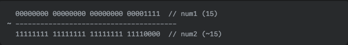

## 비트 연산자

비트 연산자는 비트 단위의 연산을 진행하여 주로 하드웨어 관련 프로그래밍에 활용되며 메모리 공간 효율을 높이고 연산의 수를 줄이도록 해준다. 아래의 표에서 주로 사용하는 비트 연산자들의 기능과 기호에 대해서 알아보도록 하자.

| 연산자 | 연산자의 기능                                              |
| ------ | ---------------------------------------------------------- |
| &      | 비트 단위로 AND 연산 수행<br />ex) num1 & num2;            |
| \|     | 비트 단위로 OR 연산 수행<br />ex) num1 \| num2;            |
| ^      | 비트 단위로 XOR 연산 수행<br />ex) num1 ^ num2;            |
| ~      | 단항 연산자로서 피연산자의 모든 비트를 반전<br />ex) ~num; |
| <<     | 피연산자의 비트 열을 왼쪽으로 이동<br />ex) num<<2;        |
| >>     | 피연산자의 비트 열을 오른쪽으로 이동<br />ex) num>>2;      |

">>"와 "<<" 연산자는 비트 이동 연산자로 부르며 비트 연산자와는 조금 다르다. 간단하게 설명하자면, 이 연산자들은 좌측의 피연산자들을 우측만큼 비트 이동시킨 것이다.


### & 연산자 - AND

& 연산자는 두 개의 비트가 모두 1일 때 1을 반환하는 연산이다. 아래 예제를 통해 자세히 알아보자.

```c
#include <stdio.h>

int main(void) {
    int num1 = 15;  // 01111
    int num2 = 20;  // 10100
    int num3 = num1 & num2;

    printf("AND 연산의 결과: %d\n", num3);
    return 0;
}
```

위 코드를 실행하면 4라는 결과가 나온다. 그 이유는 각각의 수를 2진수로 바꾸면 주석에 넣은 값과 같은데 &연산은 모두 1일 때만 1로 반환하고 나머지는 전부 0으로 반환한다. 따라서, num1과 num2를 &연산하면 00100이 되며 이를 10진수로 변환하면 4가 되기 때문에 결과가 4로 나온 것이다.


### | 연산자 - OR

| 연산자는 두 개의 비트 중 하나라도 1이면 1을 반환하는 연산이다. 아래 예제를 통해 알아보자.

```c
#include <stdio.h>

int main(void) {
    int num1 = 15;  // 01111
    int num2 = 20;  // 10100
    int num3 = num1 | num2;

    printf("OR 연산의 결과: %d\n", num3);
    return 0;
}
```

위 코드를 실행하면 31이 나온다. 그 이유는 둘 중 하나만 1이면 1을 반환하기 때문에 2진수로 나타내면 11111이기 때문에 10진수로 변환하면 31이 되기 때문에 결과가 31로 나온 것이다.


### ^ 연산자 - XOR

^ 연산자는 두 개의 비트가 서로 다른 경우에 1을 반환하는 연산이다. 아래 예제를 통해 알아보자.

```c
#include <stdio.h>

int main(void) {
    int num1 = 15;  // 01111
    int num2 = 20;  // 10100
    int num3 = num1 ^ num2;

    printf("XOR 연산의 결과: %d\n", num3);
    return 0;
}
```

위 코드를 실행하면 27이 나온다. 그 이유는 두 개의 비트가 서로 다른 경우에 1을 반환하기 때문에 2진수로 나타내면 11011이기 때문에 10진수로 변환하면 27이 되기 때문에 결과가 27로 나온 것이다.


### ~ 연산자 - NOT

~ 연산자는 비트를 0에서 1로, 1에서 0으로 반전 시키는데, 이 때문에 보수 연산이라고도 한다.

```c
#include <stdio.h>

int main(void) {
    int num1 = 15;  // 01111
    int num2 = ~num1;

    printf("NOT 연산의 결과: %d\n", num2);
    return 0;
}
```

`~` 연산자는 모든 비트(0은 1로, 1은 0으로)를 반전시킵니다. 따라서 `num1`에 `~` 연산을 적용한 `num2`의 값은 다음과 같습니다.



MSB(최상위 비트)가 1이면 음수를, 0이면 양수를 나타내는데, ~ 연산 후 num2는 MSB가 1이 되었기 때문에 음수가 된다.

num2의 2진수 값을 10진수로 변환하는 과정은 다음과 같다.

1. 다시 비트 반전시키기 -> 00000000 00000000 00000000 00001111
2. 위 결과에 1 더하기     -> 00000000 00000000 00000000 00010000

이 결과는 16이 되고 여기에 음수로 바꾸면 결과는 -16이라는 것을 알 수 있다.


## **Reference**

- 열혈 C 프로그래밍(저자 - 윤성우)
