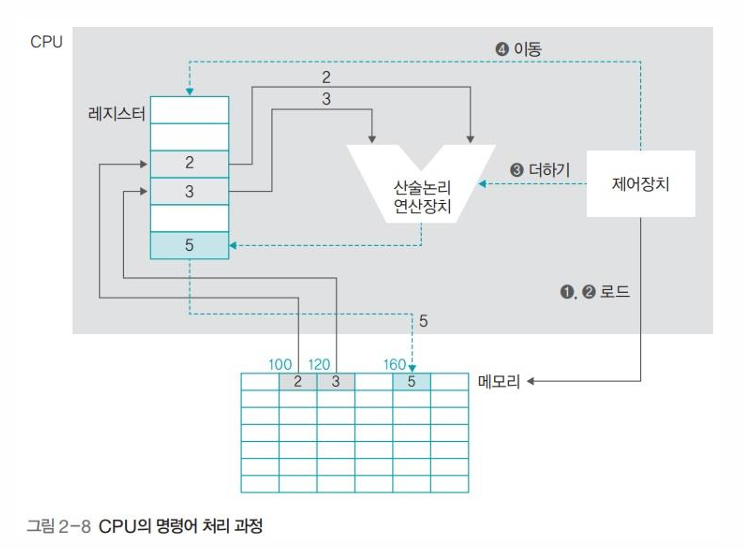
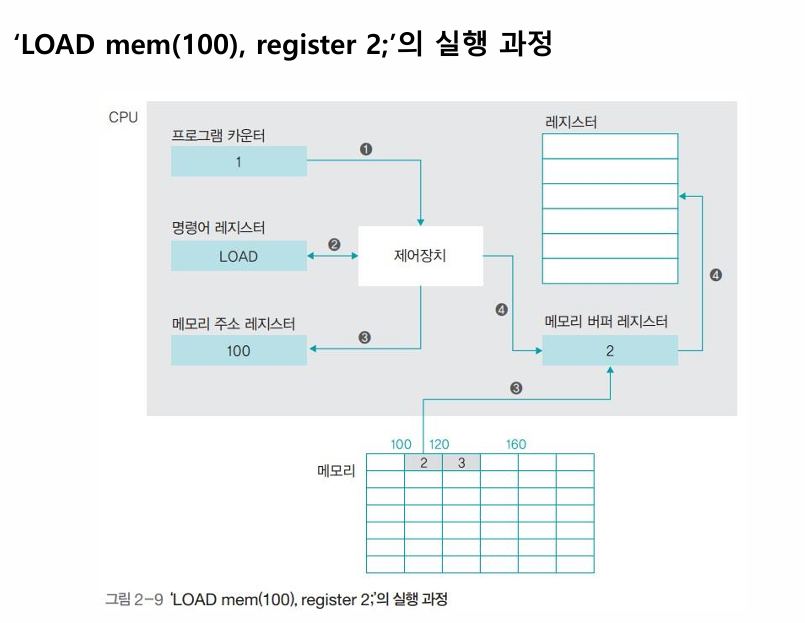
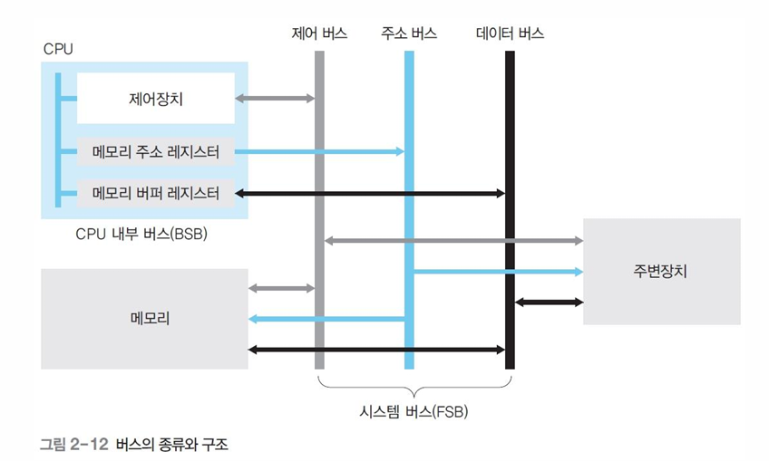

### **CPU의 명령어 처리 과정**

```c
int D2 =2, D3 = 3, sum;
sum = D2 + D3;
```

위의 코드를 어셈블리어로 바꾸면 아래와 같다.

```assembly
LOAD mem(100), register 2;
LOAD mem(120), register 3;
ADD register 5, register 2, register 3;
MOVE register 5, mem(160);
```

**1행 : 메모리의 100번지[D2]에서 2를 가져와 레지스터 2에 둔다.** 

**2행 : 메모리의 120번지[D3]에서 3을 가져와 레지스터 3에 둔다.**

**3행 : 레지스터 2와 레지스터 3에 저장된 값을 더한 결과를 레지스터 5에 넣는다.**

**4행 : 레지스터 5의 값을 메모리의 160번지[sum]에 저장한다.**




위 그림은 어셈블리어에서 실행한 내용을 전체적인 구조로 나타낸 것이다. 이를 분석해보자.

1. **먼저 제어장치가 메모리에 명령을 내린다.(데이터 '2'와 '3'을 레지스터로 가져온다)**
2. **제어장치가 산술논리 연산장치에 '덧셈' 명령을 내린다.**
3. **이후 제어장치가 '이동' 명령을 내린다.(저장된 결과를 메모리로 이동)**


### **레지스터의 종류**

| 레지스터                    | 특징                                                         |
| --------------------------- | ------------------------------------------------------------ |
| 데이터 레지스터(DR)         | CPU가 명령어를 처리하는 데 필요한 일반 데이터를 임시로 저장하는 범용 레지스터이다. |
| 주소 레지스터(AR)           | 데이터 또는 명령어가 저장된 메모리의 주소를 저장한다.        |
| 프로그램 카운터(PC)         | 다음에 실행할 명령어의 위치 정보(코드의 행 번호, 메모리 주소)를 저장한다. |
| 명령어 레지스터(IR)         | 현재 실행 중인 명령어를 저장한다.                            |
| 메모리 주소 레지스터(MAR)   | 메모리 관리자가 접근해야 할 메모리의 주소를 저장한다.        |
| 메모리 버퍼 레지스터(MBR)   | 메모리 관리자가 메모리에서 가져온 데이터를 임시로 저장한다.  |
| 프로그램 상태 레지스터(PSR) | 연산 결과(양수, 음수 등)를 저장한다.                         |


### **LOAD mem(100), register 2;의 실행 과정**



1. **프로그램 카운터(PC) 조회**
   - 제어장치가 프로그램 카운터(PC)를 확인하여 1번 명령어를 실행할 것을 확인
2. **명령어 레지스터(IR)로 이동 및 해석**
   - 제어장치가 1번 명령어인 "LOAD"를 명령어 레지스터로 가져와 해석
3. **데이터 가져오기(주소 → MBR)**
   - 제어장치가 명령어에 적힌 주소 '100'을 메모리 주소 레지스터(MAR)로 전송
   - 메모리는 MAR에 적힌 주소를 확인 후 그 주소에 저장된 데이터를 MBR에 임시 저장
4. **레지스터에 최종 저장**
   - MBR에 임시 저장된 데이터를 **레지스터**에 최종 저장


### **버스의 종류 및 특징**



1. 데이터 버스
   - 역할: 데이터가 이동하는 통로
   - 연결: CPU의 메모리 버퍼 레지스터(MBR)와 연결. MBR은 데이터를 메모리에서 가져오거나 메모리로 보낼 때 임시로 담아두는 장소
   - 방향: 양방향. 데이터를 메모리에서 CPU로 읽어올 수도 있고, 메모리로 내보낼 수도 있음
2. 주소 버스
   - 역할: 데이터의 주소가 이동하는 통로
   - 연결: CPU의 메모리 주소 레지스터(MAR)와 연결. MAR은 CPU가 접근하려는 메모리 주소를 저장하는 곳
   - 방향: 단방향
3. 제어 버스
   - 역할: CPU의 제어장치가 보내는 명령 신호가 이동하는 통로
   - 연결: CPU의 제어장치와 직접 연결
   - 방향: 양방향

위의 데이터 버스, 주소 버스, 제어 버스의 3가지 버스를 합쳐서 **시스템 버스(FSB)**라고 부른다. 이는 CPU, 메모리, 주변 장치 등 주요 장치들을 연결하는 메인 통로이다. 또한, CPU 안에 있는 제어 장치, MAR, MBR 등이 서로 통신할 때 사용하는 CPU 내부의 전용 통로를 **CPU 내부 버스(BSB)**라고 한다.
