## **ROS2 jazzy 설치 전 환경 세팅**

### **1. CHOCOLATEY 설치**

**Chocolatey는 Windows용 패키지 관리자입니다.** Ubuntu의 apt와 유사하게, Chocolatey를 사용하면 명령줄을 통해 다양한 소프트웨어를 쉽게 설치하고 관리할 수 있습니다.

ROS 2 개발에 필요한 다양한 Windows용 패키지를 효율적으로 설치하고 관리하기 위해 Chocolatey를 설치하겠습니다. 설치는 **관리자 권한으로 실행한 PowerShell**에서 진행합니다.

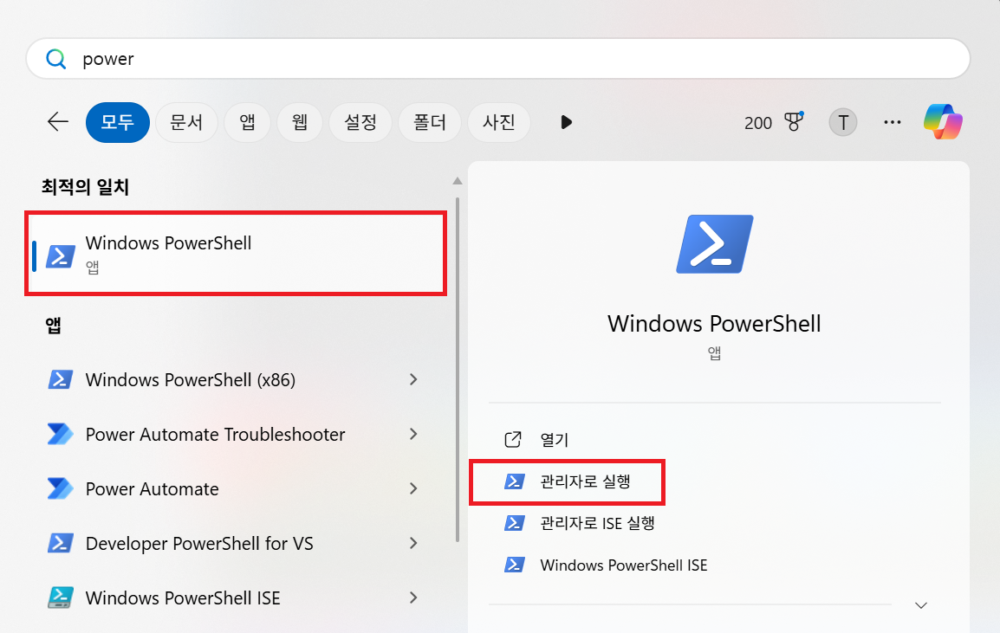

```powershell
Set-ExecutionPolicy Bypass -Scope Process -Force; [System.Net.ServicePointManager]::SecurityProtocol = [System.Net.ServicePointManager]::SecurityProtocol -bor 3072; iex ((New-Object System.Net.WebClient).DownloadString('https://community.chocolatey.org/install.ps1'))
```

이 명령어를 **관리자 권한으로 실행한 PowerShell**에 붙여넣고 실행하여 Chocolatey 설치를 시작합니다. 설치 과정 중 'Y/N' 확인 프롬프트가 나타날 수 있습니다.

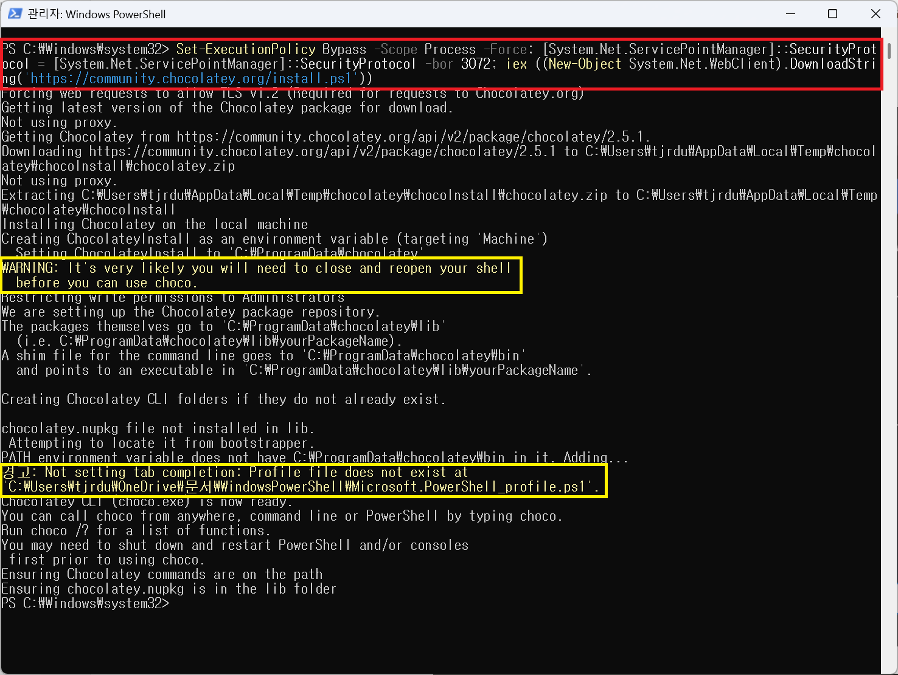

Chocolatey가 정상적으로 설치되었는지 확인하기 위해 **PowerShell을 재시작**한 후, 다음 명령어를 입력합니다.

```powershell
choco
```

명령 실행 후, Chocolatey의 버전 정보가 출력되면 성공적으로 설치된 것입니다.

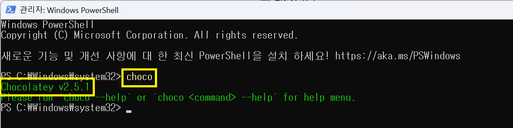


### **2. 윈도우 터미널 설치**

윈도우의 WSL2 환경에서 ROS2를 편리하게 사용하기 위해 터미널 탭을 여러 개 띄워 사용하는 것이 일반적이다. 이를 위해 필요한 것이 윈도우 터미널이며 이를 위해 choco를 이용하여 설치하도록 하겠습니다.

```powershell
choco install -y microsoft-windows-terminal
```

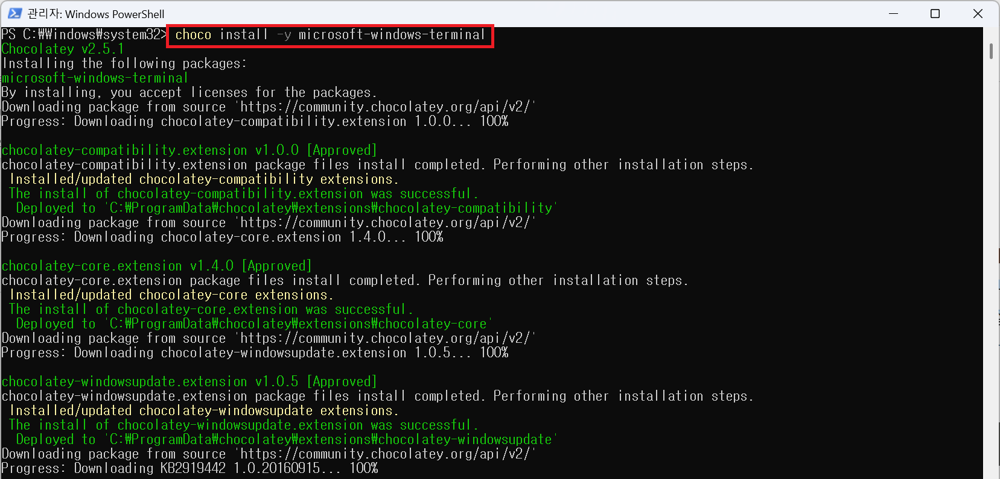

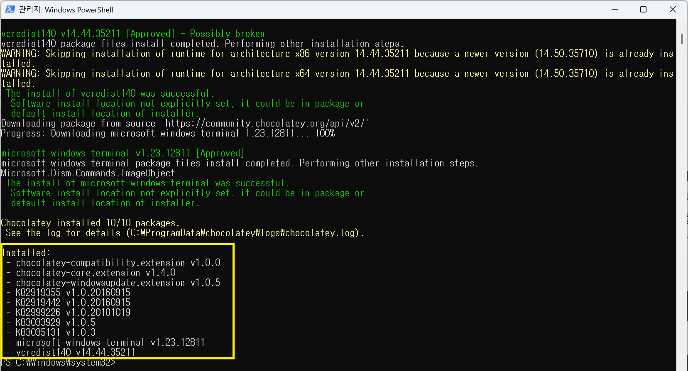

정상적으로 설치가 완료되면 위와 같이 설치 내역을 확인할 수 있습니다.


### **3. CMake 설치**

CMake는 **운영체제 독립적인 빌드 시스템**으로, ROS 2의 **colcon 빌드 도구**가 프로젝트를 빌드하는 데 필수적으로 사용됩니다. 따라서 CMake를 설치해야 합니다.

```powershell
choco install -y cmake
```

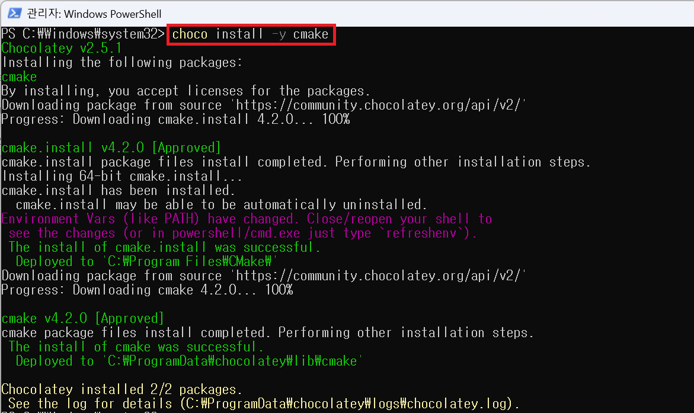

CMake 설치가 완료되면, 환경 변수 설정에 대한 안내 메시지가 출력될 수 있습니다. 설치가 성공적으로 완료되었음을 확인합니다.


### **4. Ubuntu 업데이트 및 WSL 설치**

#### **1단계: Ubuntu 실행 및 시스템 업데이트**

Windows 검색창에서 **Ubuntu 24.04**를 검색하여 관리자 권한으로 실행합니다.

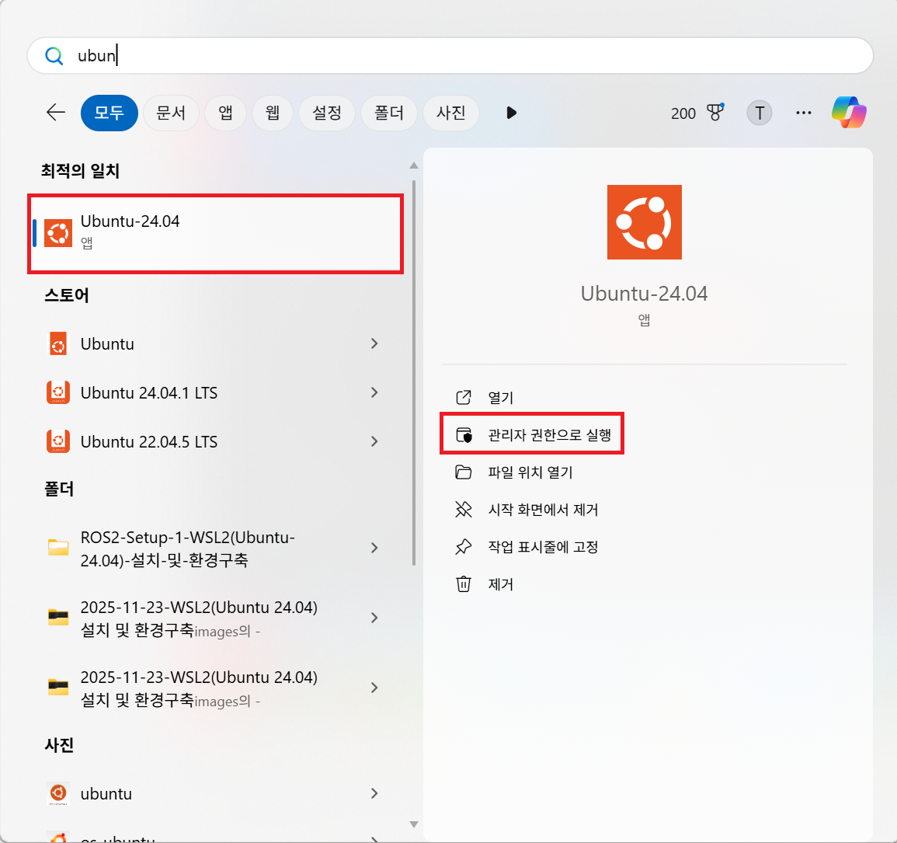

Ubuntu를 실행한 후, 아래 세 가지 명령어를 순서대로 입력하여 패키지 목록 업데이트 및 시스템 업그레이드를 진행합니다.

```bash
sudo apt update
sudo apt upgrade -y
sudo apt autoremove
```

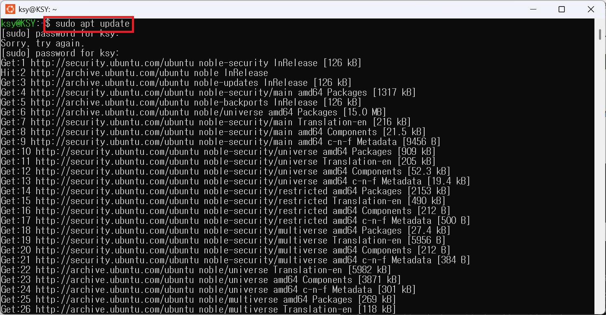

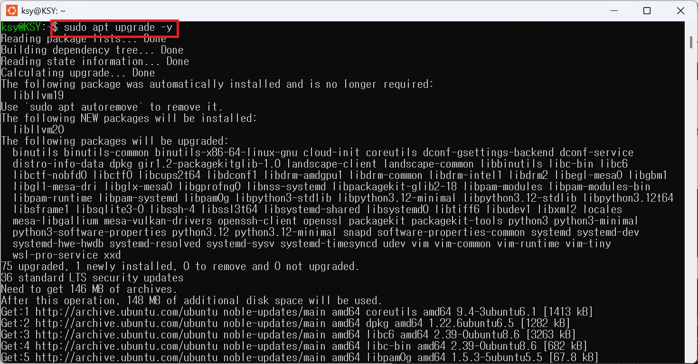

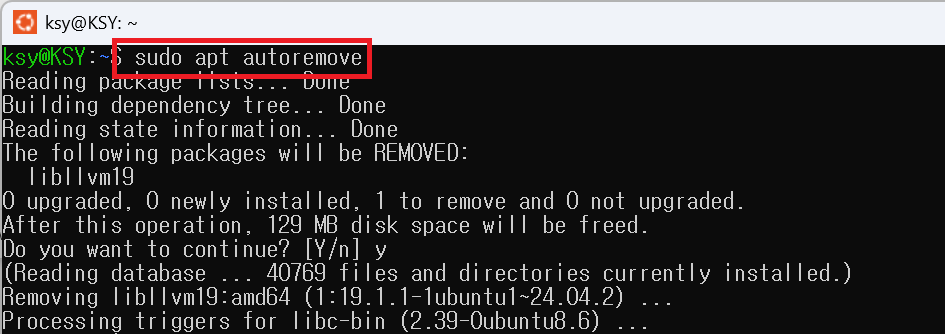


#### **2단계: WSL 패키지 설치/업데이트**

최신 WSL 기능 및 호환성을 위해 다음 명령어를 입력하여 WSL 패키지를 설치하거나 업데이트합니다.

```bash
sudo apt install wsl -y
wsl		# 설치 확인
```

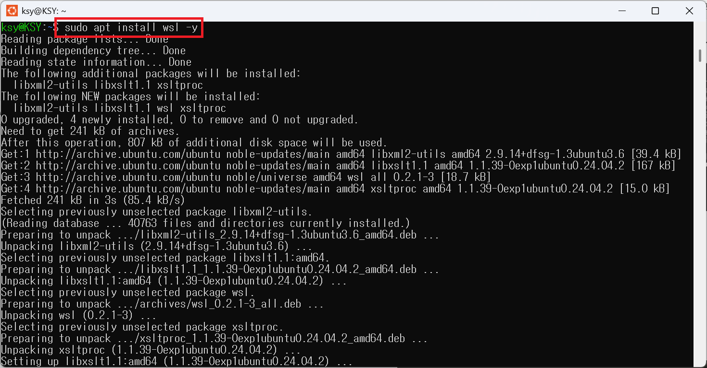


## **ROS2 설치**

이제 본격적으로 ROS2를 설치해보도록 하겠습니다. 여기에서는 ROS2의 최신 버전인 jazzy 버전을 아래 문서를 따라서 설치하겠습니다. 여기에서 다루지 않는 내용은 아래 문서를 참조하시면 되겠습니다.

[Ubuntu (deb packages) — ROS 2 Documentation: Jazzy documentation](https://docs.ros.org/en/jazzy/Installation/Ubuntu-Install-Debs.html)


### **1. Locale Settings**

이제 **ROS 2의 최신 LTS 버전인 Jazzy Jalisco**를 본격적으로 설치하겠습니다. 아래 과정은 공식 문서의 절차를 따르며, 설치 전 필수 환경 설정과 저장소 추가 단계를 포함합니다. 

ROS 2 설치 시 **Locale 설정**은 필수입니다. ROS 2는 **UTF-8 인코딩**을 기본으로 사용하므로, 시스템의 Locale이 `en_US.UTF-8`로 설정되어 있는지 확인하고 변경해야 합니다. 먼저 `locale` 명령어를 입력하여 현재 시스템의 Locale 설정을 확인합니다.

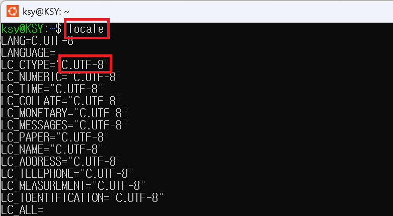

아래 명령어를 순서대로 실행하여 Locale을 설치 및 `en_US.UTF-8`로 설정합니다.

```bash
locale  # check for UTF-8

sudo apt update && sudo apt install locales
sudo locale-gen en_US en_US.UTF-8
sudo update-locale LC_ALL=en_US.UTF-8 LANG=en_US.UTF-8
export LANG=en_US.UTF-8

locale  # verify settings
```


### **2. ROS2 apt 저장소 추가**

ROS 2 패키지를 설치하려면, 먼저 **Ubuntu Universe 저장소**가 활성화되어 있는지 확인해야 합니다.

```bash
apt-cache policy | grep universe
```

위 명령어 실행 후, **`universe`** 저장소가 목록에 출력되면 정상입니다.

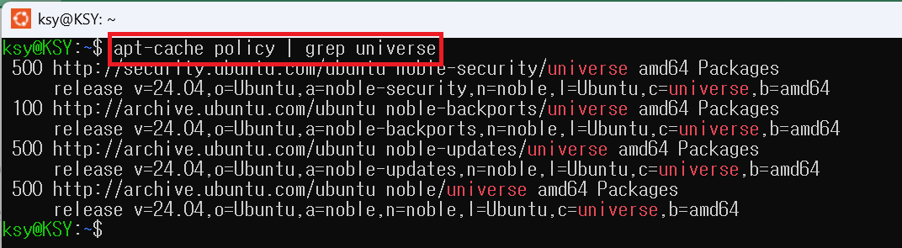

만약 `universe` 저장소가 목록에 보이지 않는다면, 다음 명령어를 실행하여 **Universe 저장소를 활성화**합니다.

```bash
sudo apt install software-properties-common
sudo add-apt-repository universe
```

다음으로, ROS 2 패키지의 신뢰성을 확보하기 위해 **GPG 키(Public Key)**를 추가합니다.

```bash
sudo apt update && sudo apt install curl -y
sudo curl -sSL https://raw.githubusercontent.com/ros/rosdistro/master/ros.key -o /usr/share/keyrings/ros-archive-keyring.gpg
```

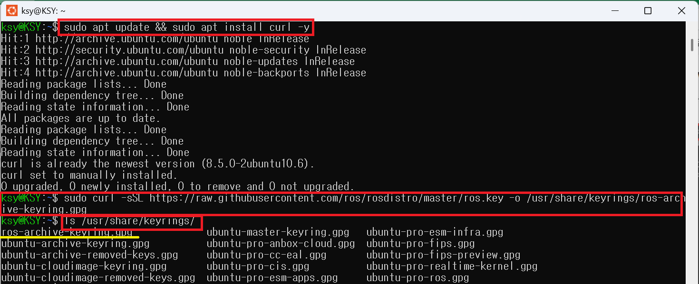

GPG 키가 성공적으로 추가되면 위 스크린샷과 같이 `ros-archive-keyring.gpg` 파일에 관련된 메시지가 출력됩니다.


### **3. 소스 목록에 저장소 추가**

#### **1단계: APT 소스 목록에 ROS 2 저장소 등록**

```powershell
echo "deb [arch=$(dpkg --print-architecture) signed-by=/usr/share/keyrings/ros-archive-keyring.gpg] http://packages.ros.org/ros2/ubuntu $(. /etc/os-release && echo $UBUNTU_CODENAME) main" | sudo tee /etc/apt/sources.list.d/ros2.list > /dev/null
```

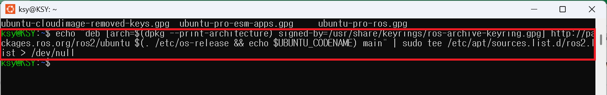

#### **2단계: 저장소 파일 등록 확인**

ROS 2 저장소 파일(`ros2.list`)이 정상적으로 생성되었는지 확인합니다.

파일 목록에서 **`ros2.list`** 파일이 확인되면 성공입니다.

```powershell
ls /etc/apt/sources.list.d
```

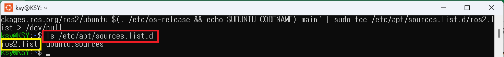


### **4. 파이썬과 개발 도구 설치**

#### **1단계: Python 개발 도구 설치**

ROS 2 빌드 및 개발에 필요한 핵심 Python 도구들(flake8, pytest 등)과 `ros-dev-tools`를 설치합니다.

```bash
sudo apt update && sudo apt install -y \
  python3-flake8-blind-except \
  python3-flake8-class-newline \
  python3-flake8-deprecated \
  python3-mypy \
  python3-pip \
  python3-pytest \
  python3-pytest-cov \
  python3-pytest-mock \
  python3-pytest-repeat \
  python3-pytest-rerunfailures \
  python3-pytest-runner \
  python3-pytest-timeout \
  ros-dev-tools
```

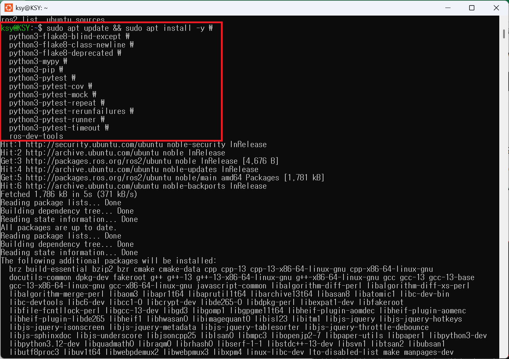


### **5. ROS2 jazzy 패키지 설치**

이제 마지막 단계로, **ROS 2 Jazzy Desktop 버전**을 설치합니다.

이 명령어는 ROS 2의 핵심 기능 외에도 **데스크톱 환경(RViz, Gazebo) 및 일반적인 개발 도구**를 함께 설치합니다.

```bash
sudo apt install ros-jazzy-desktop -y
```

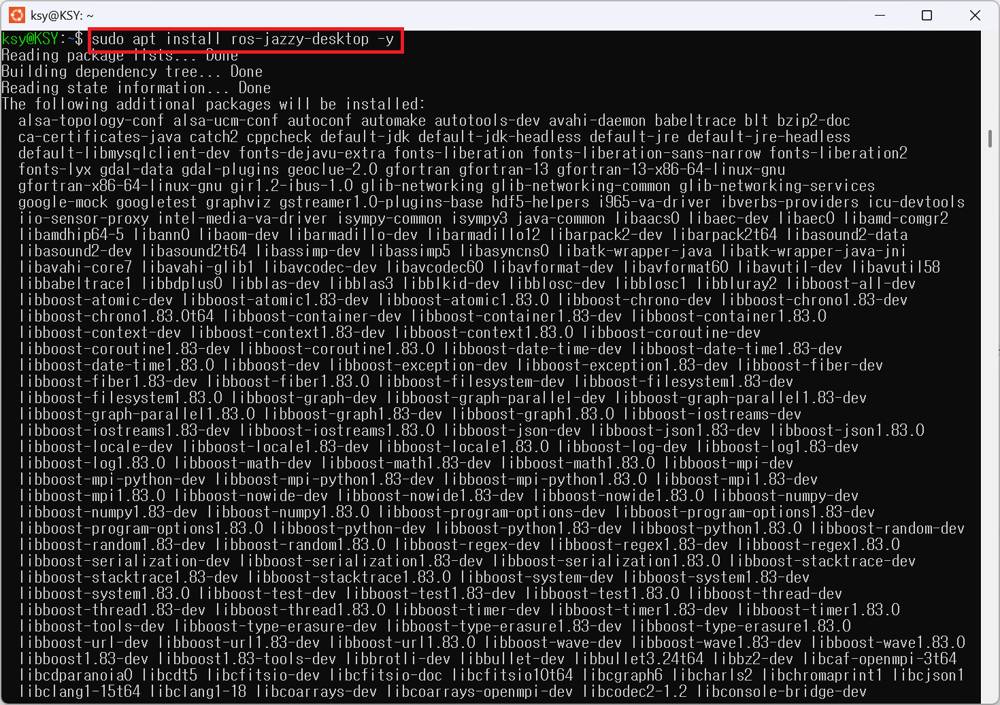


### **6. ROS 2 워크스페이스(Workspace) 생성 및 빌드 테스트**

#### **1단계: 워크스페이스 생성 및 이동**

ROS 2 개발을 위한 워크스페이스를 생성하고 해당 디렉터리로 이동합니다.

```powershell
mkdir -p ~/robot_ws/src
cd ~/robot_ws/
```

#### **2단계: Colcon 빌드 실행**

생성된 워크스페이스에서 `colcon` 빌드 도구를 실행하여 빌드를 테스트합니다.

빌드가 성공적으로 완료되면, 워크스페이스(`~/robot_ws`) 내부에 **`build`, `install`, `log`, `src`** 네 개의 폴더가 생성됩니다.

```powershell
colcon build --symlink-install
ls
```

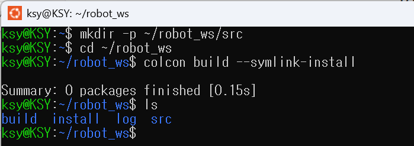


## **✅ 설치 완료 및 다음 단계 예고**

이로써 ROS 2 Jazzy 설치와 빌드 테스트가 성공적으로 완료되었습니다. 

다음 포스팅에서는 **YDLidar X3 제품**을 활용하여 **Lidar 센서 데이터를 시각화하는 과정**을 본격적으로 다루겠습니다.

## **References**

- 새벽이슬 블로그 - [Windows 에서 ROS2 설치 사용 방법 총정리 ROS2 Jazzy 최신버전 설치 방법 ](https://m.blog.naver.com/dorergiverny/223567758094#)

