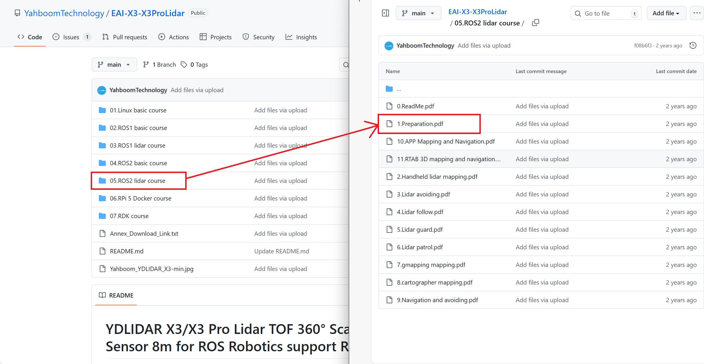
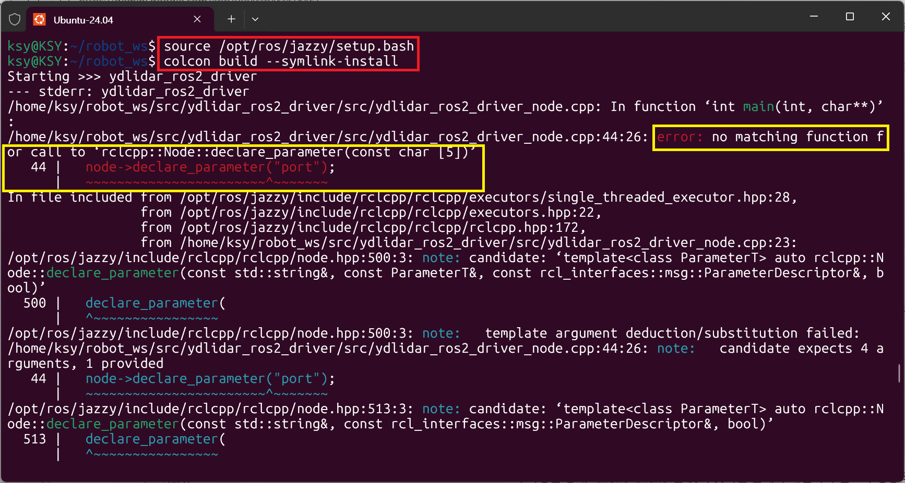
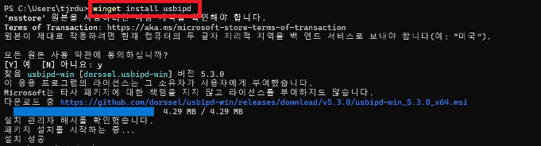
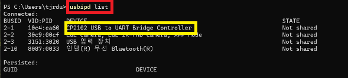
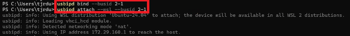
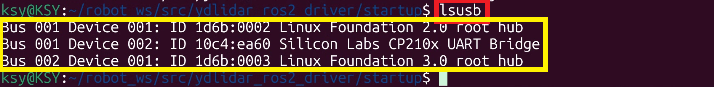

### **1. YDLidar SDK 설치 준비 및 과정 (WSL2 기반)**

본 가이드는 **WSL2**에 설치된 **ROS2(Jazzy)** 환경에서 **YDLidar X3/X3 Pro Lidar**를 위한 SDK 및 ROS 패키지를 설치하는 방법을 다룹니다.

**주의:** 모든 작업은 **최상위 사용자 폴더(`~`)** 또는 원하는 개발 루트 폴더에서 진행하는 것을 권장합니다. 

[YDLidar X3 Github 페이지](https://github.com/YahboomTechnology/EAI-X3-X3ProLidar/tree/main#)

#### **1.1. YDLidar SDK 다운로드**

YDLidar의 핵심 기능을 제공하는 SDK를 GitHub에서 클론(Clone)하여 다운로드합니다. 또한, 제조사에서 제공하는 **사진 및 PDF 파일**을 다운로드하여 설치 순서 및 가이드를 참고할 수 있습니다.



1. **홈 디렉터리(`~`)**로 이동 후, SDK를 다운로드하고 해당 디렉터리로 진입합니다.

   ```bash
   git clone https://github.com/YDLIDAR/YDLIDAR-SDK.git
   cd YDLIDAR-SDK
   ```

   **📌 참고: 사진 및 PDF 다운로드 경로** YDLidar 제조사에서 제공하는 **설치 가이드(PDF)** 및 참고 **사진 자료**는 다운로드한 **YDLIDAR-SDK** 디렉터리의 최상위 루트에서 확인 및 다운로드할 수 있습니다. 해당 자료를 참고하여 설치를 진행해 주십시오.

2. SDK 빌드를 위한 `build` 디렉터리를 생성하고 진입합니다.

   ```bash
   mkdir build
   cd build
   ```

3. `cmake`를 이용하여 컴파일 환경을 설정하고, `make`로 소스 코드를 빌드한 후, `sudo make install`로 시스템에 설치합니다.

   ```bash
   cmake ..
   make
   sudo make install
   ```

4. 설치가 완료되면, 최상위 사용자 폴더(`~`)로 다시 복귀합니다.

   ```bash
   cd ~
   ```

### **2. ROS 2 패키지 다운로드 및 빌드**

다음으로 ROS 2 환경에서 Lidar 센서를 구동하고 데이터를 처리하기 위한 `ydlidar_ros2_driver` 패키지를 **ROS2 워크스페이스**에 설치하고 빌드합니다.

#### **2.1. ROS2 환경 설정 확인**

먼저, 현재 터미널이 ROS2 환경을 사용할 수 있도록 **환경 설정 파일(setup.bash)**이 소스되었는지 확인해야 합니다.

```bash
source /opt/ros/jazzy/setup.bash
```

#### **2.2. ROS2 워크스페이스에 패키지 설치**

`robot_ws` 워크스페이스의 `src` 디렉터리로 이동하여 ROS2 드라이버 패키지를 다운로드합니다.

1. **워크스페이스의 `src` 폴더**로 이동합니다. (예: `~/robot_ws/src`)

   ```bash
   cd ~/robot_ws/src
   ```

2. **YDLidar ROS2 드라이버** 패키지를 GitHub에서 클론합니다.

   ```bash
   git clone https://github.com/YDLIDAR/ydlidar_ros2_driver.git
   ```

#### **2.3. 워크스페이스 빌드**

다운로드한 패키지를 ROS2 시스템에서 사용할 수 있도록 **워크스페이스 루트(`~/robot_ws`)**로 돌아가 빌드합니다.

1. 워크스페이스 루트 디렉터리로 이동합니다.

   ```bash
   cd ~/robot_ws
   ```

2. `colcon build` 명령어를 사용하여 워크스페이스 내의 모든 패키지를 빌드합니다. (심볼릭 링크 옵션 추천)

   ```bash
   colcon build --symlink-install
   ```

   

### **3. YDLidar ROS2 드라이버 노드 파라미터 인식 오류 수정**

이 섹션에서는 **YDLidar ROS2 드라이버**를 실행할 때 발생할 수 있는 **파라미터(Parameter) 인식 오류**와 그 해결 방법에 대해 다룹니다. 특히, 최신 ROS2 배포판인 **Jazzy** 환경에서 파라미터가 정상적으로 로드되지 않아 드라이버가 오작동하는 경우가 발생할 수 있습니다.

이러한 문제는 주로 노드 초기화 시 파라미터 선언 방식과 ROS2 버전 간의 **버전 불일치** 때문에 발생합니다. `ydlidar_ros2_driver_node.cpp` 파일 내에서 특정 파라미터 값들이 올바르게 읽히지 않을 때 노란색 하이라이트된 이미지와 같은 오류 메시지가 나타날 수 있습니다.

이 문제를 해결하기 위해 **VSCode**와 같은 코드 편집기를 사용하여 `ydlidar_ros2_driver_node.cpp` 파일을 열고, 파라미터 선언 및 처리 로직을 수정하는 과정을 진행하겠습니다.



```c++
int main(int argc, char *argv[]) {
  rclcpp::init(argc, argv);

  auto node = rclcpp::Node::make_shared("ydlidar_ros2_driver_node");

  RCLCPP_INFO(node->get_logger(), "[YDLIDAR INFO] Current ROS Driver Version: %s\n", ((std::string)ROS2Verision).c_str());

  CYdLidar laser;
  std::string str_optvalue = "/dev/ydlidar";
  // [수정] 기본값 str_optvalue 추가
  node->declare_parameter("port", str_optvalue);
  node->get_parameter("port", str_optvalue);
  ///lidar port
  laser.setlidaropt(LidarPropSerialPort, str_optvalue.c_str(), str_optvalue.size());

  ///ignore array
  str_optvalue = "";
  // [수정] 기본값 str_optvalue 추가
  node->declare_parameter("ignore_array", str_optvalue);
  node->get_parameter("ignore_array", str_optvalue);
  laser.setlidaropt(LidarPropIgnoreArray, str_optvalue.c_str(), str_optvalue.size());

  std::string frame_id = "laser_frame";
  // [수정] 기본값 frame_id 추가
  node->declare_parameter("frame_id", frame_id);
  node->get_parameter("frame_id", frame_id);

  //////////////////////int property/////////////////
  /// lidar baudrate
  int optval = 230400;
  // [수정] 기본값 optval 추가 (아래 int형 모두 동일하게 수정됨)
  node->declare_parameter("baudrate", optval);
  node->get_parameter("baudrate", optval);
  laser.setlidaropt(LidarPropSerialBaudrate, &optval, sizeof(int));
  /// tof lidar
  optval = TYPE_TRIANGLE;
  node->declare_parameter("lidar_type", optval);
  node->get_parameter("lidar_type", optval);
  laser.setlidaropt(LidarPropLidarType, &optval, sizeof(int));
  /// device type
  optval = YDLIDAR_TYPE_SERIAL;
  node->declare_parameter("device_type", optval);
  node->get_parameter("device_type", optval);
  laser.setlidaropt(LidarPropDeviceType, &optval, sizeof(int));
  /// sample rate
  optval = 9;
  node->declare_parameter("sample_rate", optval);
  node->get_parameter("sample_rate", optval);
  laser.setlidaropt(LidarPropSampleRate, &optval, sizeof(int));
  /// abnormal count
  optval = 4;
  node->declare_parameter("abnormal_check_count", optval);
  node->get_parameter("abnormal_check_count", optval);
  laser.setlidaropt(LidarPropAbnormalCheckCount, &optval, sizeof(int));

  /// Intenstiy bit count
  optval = 0;
  node->declare_parameter("intensity_bit", optval);
  node->get_parameter("intensity_bit", optval);
  laser.setlidaropt(LidarPropIntenstiyBit, &optval, sizeof(int));
      
  //////////////////////bool property/////////////////
  /// fixed angle resolution
  bool b_optvalue = false;
  // [수정] 기본값 b_optvalue 추가 (아래 bool형 모두 동일하게 수정됨)
  node->declare_parameter("fixed_resolution", b_optvalue);
  node->get_parameter("fixed_resolution", b_optvalue);
  laser.setlidaropt(LidarPropFixedResolution, &b_optvalue, sizeof(bool));
  /// rotate 180
  b_optvalue = true;
  node->declare_parameter("reversion", b_optvalue);
  node->get_parameter("reversion", b_optvalue);
  laser.setlidaropt(LidarPropReversion, &b_optvalue, sizeof(bool));
  /// Counterclockwise
  b_optvalue = true;
  node->declare_parameter("inverted", b_optvalue);
  node->get_parameter("inverted", b_optvalue);
  laser.setlidaropt(LidarPropInverted, &b_optvalue, sizeof(bool));
  b_optvalue = true;
  node->declare_parameter("auto_reconnect", b_optvalue);
  node->get_parameter("auto_reconnect", b_optvalue);
  laser.setlidaropt(LidarPropAutoReconnect, &b_optvalue, sizeof(bool));
  /// one-way communication
  b_optvalue = false;
  node->declare_parameter("isSingleChannel", b_optvalue);
  node->get_parameter("isSingleChannel", b_optvalue);
  laser.setlidaropt(LidarPropSingleChannel, &b_optvalue, sizeof(bool));
  /// intensity
  b_optvalue = false;
  node->declare_parameter("intensity", b_optvalue);
  node->get_parameter("intensity", b_optvalue);
  laser.setlidaropt(LidarPropIntenstiy, &b_optvalue, sizeof(bool));
  /// Motor DTR
  b_optvalue = false;
  node->declare_parameter("support_motor_dtr", b_optvalue);
  node->get_parameter("support_motor_dtr", b_optvalue);
  laser.setlidaropt(LidarPropSupportMotorDtrCtrl, &b_optvalue, sizeof(bool));
  //是否启用调试
  b_optvalue = false;
  node->declare_parameter("debug", b_optvalue);
  node->get_parameter("debug", b_optvalue);
  laser.setEnableDebug(b_optvalue);

  //////////////////////float property/////////////////
  /// unit: °
  float f_optvalue = 180.0f;
  // [수정] 기본값 f_optvalue 추가 (아래 float형 모두 동일하게 수정됨)
  node->declare_parameter("angle_max", f_optvalue);
  node->get_parameter("angle_max", f_optvalue);
  laser.setlidaropt(LidarPropMaxAngle, &f_optvalue, sizeof(float));
  f_optvalue = -180.0f;
  node->declare_parameter("angle_min", f_optvalue);
  node->get_parameter("angle_min", f_optvalue);
  laser.setlidaropt(LidarPropMinAngle, &f_optvalue, sizeof(float));
  /// unit: m
  f_optvalue = 64.f;
  node->declare_parameter("range_max", f_optvalue);
  node->get_parameter("range_max", f_optvalue);
  laser.setlidaropt(LidarPropMaxRange, &f_optvalue, sizeof(float));
  f_optvalue = 0.1f;
  node->declare_parameter("range_min", f_optvalue);
  node->get_parameter("range_min", f_optvalue);
  laser.setlidaropt(LidarPropMinRange, &f_optvalue, sizeof(float));
  /// unit: Hz
  f_optvalue = 10.f;
  node->declare_parameter("frequency", f_optvalue);
  node->get_parameter("frequency", f_optvalue);
  laser.setlidaropt(LidarPropScanFrequency, &f_optvalue, sizeof(float));

  bool invalid_range_is_inf = false;
  // [수정] 기본값 invalid_range_is_inf 추가
  node->declare_parameter("invalid_range_is_inf", invalid_range_is_inf);
  node->get_parameter("invalid_range_is_inf", invalid_range_is_inf);

  //初始化
  bool ret = laser.initialize();
  if (ret) 
  {
    //设置GS工作模式（非GS雷达请无视该代码）
    int i_v = 0;
    // [수정] 기본값 i_v 추가
    node->declare_parameter("m1_mode", i_v);
    node->get_parameter("m1_mode", i_v);
    laser.setWorkMode(i_v, 0x01);
    i_v = 0;
    node->declare_parameter("m2_mode", i_v);
    node->get_parameter("m2_mode", i_v);
    laser.setWorkMode(i_v, 0x02);
    i_v = 1;
    node->declare_parameter("m3_mode", i_v);
    node->get_parameter("m3_mode", i_v);
    laser.setWorkMode(i_v, 0x04);
    //启动扫描
    ret = laser.turnOn();
  } 
  else 
  {
    RCLCPP_ERROR(node->get_logger(), "%s\n", laser.DescribeError());
  }
  
  auto laser_pub = node->create_publisher<sensor_msgs::msg::LaserScan>("scan", rclcpp::SensorDataQoS());

  auto stop_scan_service =
    [&laser](const std::shared_ptr<rmw_request_id_t> request_header,
  const std::shared_ptr<std_srvs::srv::Empty::Request> req,
  std::shared_ptr<std_srvs::srv::Empty::Response> response) -> bool
  {
    (void)request_header;
    (void)req;
    (void)response;
    return laser.turnOff();
  };

  auto stop_service = node->create_service<std_srvs::srv::Empty>("stop_scan",stop_scan_service);

  auto start_scan_service =
    [&laser](const std::shared_ptr<rmw_request_id_t> request_header,
  const std::shared_ptr<std_srvs::srv::Empty::Request> req,
  std::shared_ptr<std_srvs::srv::Empty::Response> response) -> bool
  {
    (void)request_header;
    (void)req;
    (void)response;
    return laser.turnOn();
  };

  auto start_service = node->create_service<std_srvs::srv::Empty>("start_scan",start_scan_service);

  rclcpp::WallRate loop_rate(20);

  //std::ofstream file("pointcloud_data.txt"); // 打开文件流
  while (ret && rclcpp::ok()) 
  {
    LaserScan scan;
    if (laser.doProcessSimple(scan)) 
    {
      auto scan_msg = std::make_shared<sensor_msgs::msg::LaserScan>();

      scan_msg->header.stamp.sec = RCL_NS_TO_S(scan.stamp);
      scan_msg->header.stamp.nanosec =  scan.stamp - RCL_S_TO_NS(scan_msg->header.stamp.sec);
      scan_msg->header.frame_id = frame_id;
      scan_msg->angle_min = scan.config.min_angle;
      scan_msg->angle_max = scan.config.max_angle;
      scan_msg->angle_increment = scan.config.angle_increment;
      scan_msg->scan_time = scan.config.scan_time;
      scan_msg->time_increment = scan.config.time_increment;
      scan_msg->range_min = scan.config.min_range;
      scan_msg->range_max = scan.config.max_range;
      
      int size = (scan.config.max_angle - scan.config.min_angle)/ scan.config.angle_increment + 1;
      scan_msg->ranges.resize(size);
      scan_msg->intensities.resize(size);
      for (size_t i=0; i < scan.points.size(); i++) 
      {
        const auto& p = scan.points.at(i);
        (void)p; // 사용하지 않는 변수 경고 방지
        int index = std::ceil((scan.points[i].angle - scan.config.min_angle)/scan.config.angle_increment);
        if(index >=0 && index < size) {
          scan_msg->ranges[index] = scan.points[i].range;
          scan_msg->intensities[index] = scan.points[i].intensity;
        }
        //file << "i:" << i << ",a:" << p.angle << ",d:" << p.range << ",p:" << p.intensity << std::endl;
      }
      laser_pub->publish(*scan_msg);
    } 
    else 
    {
      RCLCPP_ERROR(node->get_logger(), "Failed to get scan");
    }
    if(!rclcpp::ok()) 
    {
      break;
    }
    rclcpp::spin_some(node);
    loop_rate.sleep();
  }

  RCLCPP_INFO(node->get_logger(), "[YDLIDAR INFO] Now YDLIDAR is stopping .......");
  laser.turnOff();
  laser.disconnecting();
  rclcpp::shutdown();

  return 0;
}
```

수정된 C++ 코드를 적용하고, ROS2 시스템이 변경 사항을 인식하기 위해 **이전 단계에서 진행한 `colcon build` 과정**을 다시 한번 수행해야 합니다. 그런 다음, 새로운 실행 파일을 사용할 수 있도록 **환경 설정 파일(setup.bash)**을 `source` 해야 합니다.


### **4. 수정된 코드 적용 및 환경 변수 갱신**

C++ 소스 코드(`ydlidar_ros2_driver_node.cpp`)를 수정한 후에는 **반드시** 이 변경 사항을 바이너리 실행 파일에 반영하기 위한 **재빌드 과정**이 필요합니다. 이후, ROS2 환경 변수를 갱신하여 시스템이 새로운 드라이버를 인식하도록 합니다.

#### **4.1. 워크스페이스 재빌드**

ROS2 워크스페이스의 루트 디렉터리(`~/robot_ws`)로 이동하여 `colcon build` 명령을 다시 실행합니다. 이 과정은 수정한 C++ 코드를 컴파일하고 새로운 실행 파일을 생성합니다.

```bash
cd ~/robot_ws
colcon build --symlink-install
```

#### **4.2. 환경 변수 갱신 (Source)**

빌드가 성공적으로 완료되면, ROS2 환경 설정 파일인 `install/setup.bash`를 `source`하여 새로운 드라이버 패키지의 실행 경로와 라이브러리 정보를 현재 터미널에 적용합니다.

> **❗ 중요:** 새 터미널을 열거나 코드를 수정한 후 재빌드를 할 때마다 이 단계를 반드시 수행해야 ROS2가 최신 버전을 인식합니다.

```bash
source install/setup.bash
```


### **5. Lidar 장치 권한 설정 및 USB 연결**

Lidar 센서를 사용하려면, 리눅스 시스템이 장치에 접근할 수 있는 **권한을 설정**하고, **WSL2 환경에 USB 장치를 연결**하는 과정이 필수적입니다. 이 과정은 Lidar의 장치 이름이 `/dev/ttyUSB0` 대신 `/dev/ydlidar`로 자동 설정되도록 돕습니다.

#### **5.1. 장치 권한 설정 스크립트 실행**

`ydlidar_ros2_driver` 패키지에는 Lidar 장치에 대한 접근 권한(udev rule)을 설정하는 스크립트가 포함되어 있습니다.

1. **권한 설정 스크립트가 있는 폴더**로 이동합니다.

   ```bash
   cd ~/robot_ws/src/ydlidar_ros2_driver/startup
   ```

2. 스크립트에 **실행 권한**을 부여합니다. (`777`은 모든 사용자에게 권한을 부여하는 것을 의미)

   ```bash
   sudo chmod 777 initenv.sh
   ```

3. **권한 설정 스크립트**를 실행합니다.

   ```bash
   sudo bash initenv.sh
   ```

**🔑 권한 설정 결과:** 이 스크립트가 성공적으로 실행되면, 이후 Lidar 장치가 연결될 때 **`/dev/ydlidar`**라는 이름의 장치 파일이 생성되어 ROS 노드에서 쉽게 접근할 수 있게 됩니다.

#### **5.2. USB 장치 인식 문제 해결 (WSL2)**

Linux 환경 변수를 적용하고 권한 설정 스크립트를 실행했음에도 불구하고, WSL2 환경에서 Lidar 센서가 인식되지 않을 수 있습니다. 이는 **WSL2가 호스트 윈도우 PC의 USB 장치를 공유하지 못하기 때문**입니다.

##### **A.** `lsusb` **명령어 확인 및 설치**

WSL2에서 USB 장치 목록을 확인하는 `lsusb` 명령어가 인식되지 않는 경우, 해당 도구를 설치해야 합니다.

1. `lsusb` 명령 실행 시 오류가 발생하면, `usbutils` 패키지를 설치합니다.

```bash
sudo apt install usbutils
```


2. 설치 후 다시 `lsusb`를 실행하여 현재 WSL2가 인식하는 USB 장치 목록을 확인합니다. 하지만 WSL2가 인식하지 못할 경우 이것도 문제가 발생할 수 있습니다.

##### **B.** `usbipd-win`**을 이용한 장치 연결**

WSL2 환경에서 USB 장치를 인식시키기 위해서는 호스트(Windows)에서 **`usbipd-win`** 도구를 사용하여 장치를 연결해야 합니다.

1. **Windows PowerShell (관리자 권한)**에서 `usbipd`를 설치합니다. (설치된 경우 생략)

   ```powershell
   winget install usbipd
   ```

   

2. 설치가 완료되면 Windows PowerShell에서 `usbipd list` 명령을 실행하여 현재 연결된 장치 목록을 확인합니다.

   - Lidar 장치에 해당하는 **`BUSID`**를 확인합니다. (예: `2-1`)
   - Lidar 장치의 **ID** (예: `10c4:ea60`)와 **설명**을 확인하여 Lidar를 찾습니다.

   

3. 해당 **`BUSID`**를 사용하여 장치를 WSL2에 연결(Attach)합니다.

   ```powershell
   usbipd bind --busid <BUSID>
   usbipd attach --wsl --busid <BUSID>
   ```

   

   **💡 참고:** `<BUSID>` 대신 Lidar 장치의 실제 ID (예: `2-1`)를 입력해야 합니다. 이 작업은 **Lidar 센서를 연결할 때마다** 수행해야 할 수 있습니다.

##### **C. Lidar 장치 최종 확인**

`usbipd`를 통해 장치를 연결한 후, 다시 WSL2 터미널로 돌아와 최종 확인을 진행합니다.

1. WSL2 터미널에서 **`lsusb`** 명령어를 다시 실행하여 Lidar 장치가 목록에 추가되었는지 확인합니다.

   

2. `ydlidar_ros2_driver/startup` 폴더로 이동하여 `initenv.sh` 스크립트를 재실행합니다.

   ```bash
   cd ~/robot_ws/src/ydlidar_ros2_driver/startup
   sudo bash initenv.sh
   ```

3. 마지막으로, **`/dev/ydlidar`** 장치 파일이 생성되었는지 확인합니다.

   ```bash
   ls -l /dev/ydlidar
   ```

   **✅ 성공 메시지:** `/dev/ydlidar`와 같은 출력 결과가 나오면 장치 권한 설정과 USB 연결이 모두 성공적으로 완료된 것입니다.


Lidar 센서의 권한 설정과 WSL2 연결 과정까지 완료했습니다. 이제 **ROS2 환경에서 Lidar 노드를 실행**하고 **RViz2로 데이터를 시각적으로 확인**할 준비가 되었습니다. 다음 챕터에서는 **노드 실행 및 테스트 방법**에 대해 알아보겠습니다.
