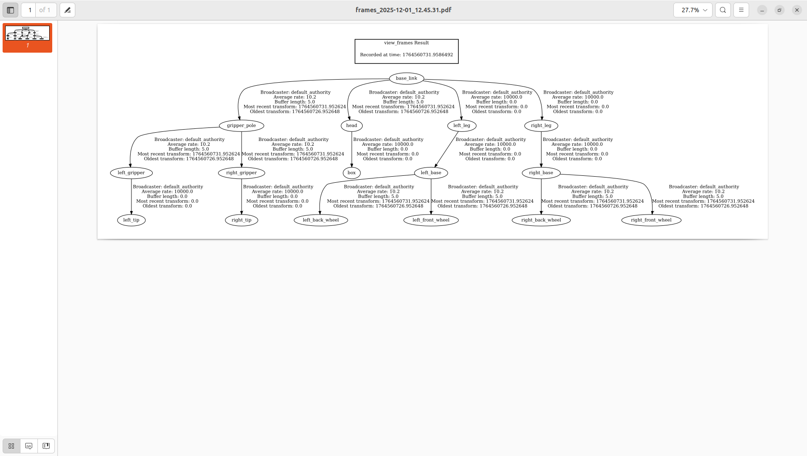

이전 가이드에서 RViz2로 로봇 외형을 보았다면, 이제 로봇의 각 부품이 **서로 어떻게 연결되어 움직이는지**를 정의하는 핵심 개념, **TF (Transform)**에 대해 깊이 있게 알아봅시다. 전에 언급한 바와 같이, TF는 로봇을 ROS에서 올바르게 구동하는 데 가장 중요한 정보입니다.


### **1. TF 트리 구조 이해하기**

TF는 단순히 각 부품의 위치를 나열하는 것이 아니라, 각 링크 간의 **상대적인 위치 관계와 움직임**을 정의하는 계층적 구조, 즉 **트리(Tree)** 형태를 가집니다.

#### **1.1. TF 트리의 구조**

- **링크(link):** 로봇의 강체를 의미하며 트리 구조의 노드 역할 수행
- **변환(Transform) / 관절(Joint):** 두 링크를 연결하는 화살표이며 링크끼리 서로 상대적인 위치와 어떻게 움직이는지를 정의
- **부모-자식 관계:** TF가 정의될 때, 최상위 링크인 `base_link`가 부모가 되며 `base_link`와 연결된 나머지 링크들이 자식이 되며 변환들의 트리가 계속 연결됨

#### **1.2. 움직임의 전파**

- 중요성: TF 사이의 관계와 순서는 매우 중요함
- 원리: 부모 관절을 움직이면, 그 아래 연결된 모든 자식 링크와 관절이 함께 움직임
- 예시: 아래 영상처럼 특정 관절을 움직이면, 이 관절의 자식에 연결된 모든 관절들도 함께 움직입니다.

    
<video src="/images/2025-11-30-TF 트리 구조와 원리/ros2-sim-demo.mp4" controls width="100%"></video>


### **2. TF 토픽과 변환의 구성 요소**

#### **2.1. TF 토픽 확인**

- `ros2 topic list` 명령어를 실행하면 토픽을 확인할 수 있으며 이 토픽이 TF 정보의 기반임
- `ros2 topic echo /tf` 명령어를 실행하면 로봇의 모든 TF 정보가 지속적으로 출력됨

#### **2.2. TF의 구성 요소(정보)**

| 구성 요소                      | 설명                                   |
| ------------------------------ | -------------------------------------- |
| 타임스탬프(sec, nanosec)       | 변환이 발생한 시간 정보                |
| 부모 프레임 ID(frame_id)       | 변환의 기준점(부모)이 되는 링크의 이름 |
| 자식 프레임 ID(child_frame_id) | 변환의 결과물(자식)이 되는 링크의 이름 |
| 변환(transform)                | 부모 대비 자식의 위치와 회전 정보      |


아래는 명령어로 출력되는 예시 정보입니다.

```yaml
---
header:
  stamp:
      sec: 1764568628
      nanosec: 830491551
  frame_id: gripper_pole        # 부모: 그리퍼 봉
child_frame_id: right_gripper   # 자식: 오른쪽 그리퍼
transform:
  translation:
    x: 0.2                      # X축으로 0.2m 이동
    y: -0.01                    # Y축으로 -0.01m 이동
    z: 0.0                      # Z축 이동 없음
  rotation:
    x: 0.0
    y: 0.0
    z: 0.0
    w: 1.0
---
```


### **3. TF 트리 구조 시각화**

TF 토픽을 읽는 대신, 전체 TF 구조를 한 장의 그림으로 보고 싶을 때, `tf2 tools` 패키지를 사용할 수 있습니다.

#### **3.1. 트리 생성 및 분석**

- 명령어 실행

```bash
ros2 run tf2_tools view_frames
```

- PDF 생성: TF 데이터를 수신하여 frames.pdf 파일 생성
- 결과 분석: 생성된 pdf 파일을 열어 전체 TF 트리 파악



- 사각형: 로봇의 링크를 나타냅니다.
- 화살표: 링크 간의 변환 관계를 나타냅니다.
- 트리 구조: `base_link`에서 시작하여 모든 프레임의 관계가 명확하게 보이며, 복잡한 로봇도 쉽게 구조를 파악할 수 있습니다.


### **4. 마무리**

TF는 아래의 두 가지를 해결하고자 합니다.

1. **구조화된 트리 유지:** 로봇의 모든 관절이나 프레임에 대한 구조화된 트리 유지
2. **프레임 간 상대적 위치:** 프레임들이 서로 상대적으로 어디에 위치하는지와 어떻게 움직이는지를 알고자 함


#### **ROS의 역할과 URDF**

- **ROS의 역할:** 모든 프레임에 대한 변환을 직접 계산하는 과정은 어렵기 때문에 ROS TF 기능을 사용합니다.
- **다음 단계:** TF를 이해했다면, 이제 로봇의 구조를 정의하는 URDF 파일을 작성하고 기존 ROS 패키지를 사용할 예정입니다.
