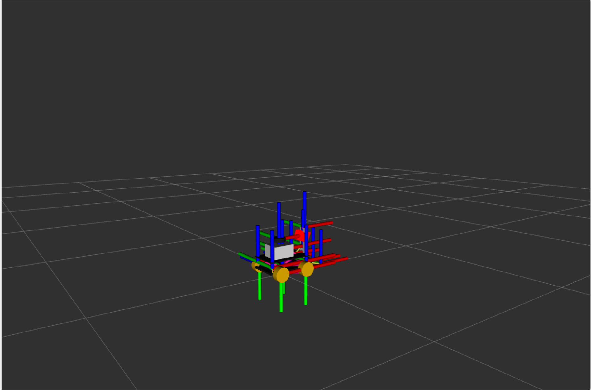
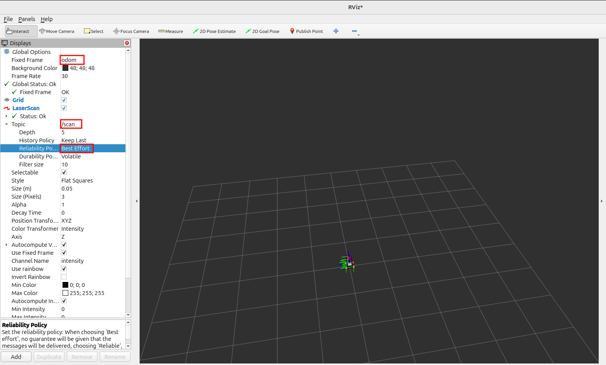
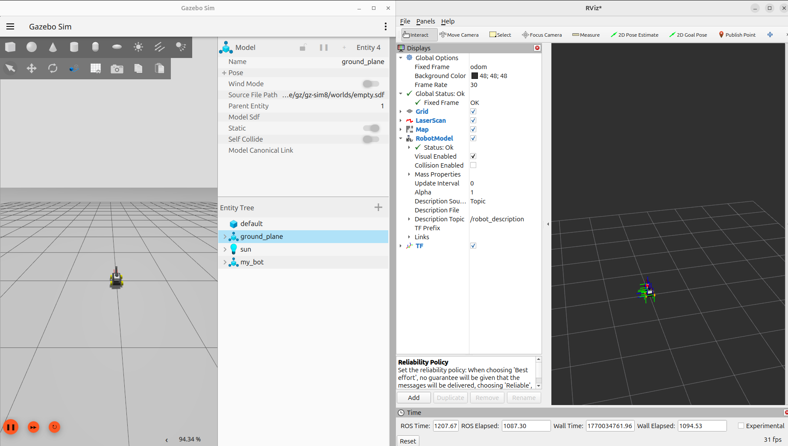
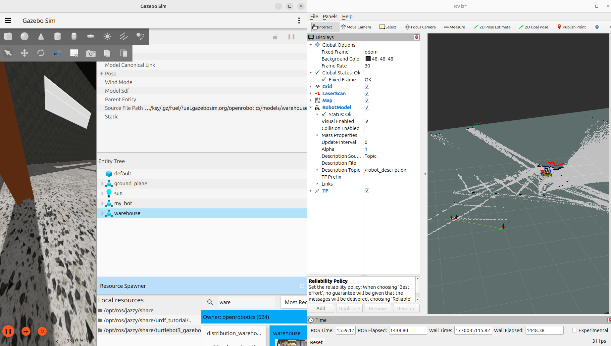

이번에는 `Gazebo `와 `Rviz` 를 이용하여 **라이다(Lidar)** 센서를 통해 받아온 데이터로 **매핑(Mapping)**을 해 보도록 하겠다. 매핑을 하기 위해서는 우선 URDF 파일로 로봇을 구성하여 `Gazebo` 환경에 로봇을 소환(Spawn)해야 하며, 이를 실행할 `Launch` 파일도 필요하다. 특히 현재 최신 버전인 **ROS 2 Jazzy** 환경에서 매핑을 진행하는 자료가 부족하여 여러 시행착오를 겪었다. 이 글에서는 트러블슈팅 과정과 정확한 설정 방법을 정리해 본다. 전체 코드는 [GitHub](https://github.com/ksyoung0310/ros2-jazzy-study) 저장소에서 확인할 수 있다. 환경은 **Ubuntu 24.04 기반의 ROS 2 Jazzy에서 실행한다.

### **URDF 정의 및 환경 설정**

#### **1. URDF의 정의**

URDF(Unified Robot Description Format)는 로봇의 물리적 형상을 정의하는 XML 기반의 파일 포맷이다. ROS에서 로봇 모델을 시각화(RViz)하거나 시뮬레이션(Gazebo)하기 위해 필수적으로 사용한다.

- **Links (링크):** 로봇의 뼈대(Chassis, 바퀴, 센서 등)를 구성하는 강체 부분이다. 시각적(Visual), 충돌(Collision), 관성(Inertial) 속성을 정의한다.
- **Joints (관절):** 링크와 링크를 연결하며, 회전(Continuous/Revolute)하거나 직선 운동(Prismatic) 등의 움직임을 정의한다.



#### **2. 환경 설정 및 경로 지정**

Gazebo 시뮬레이션을 실행하기 위해서는 ROS 2 워크스페이스 내에 올바른 **패키지 구조**를 만들고, 작성한 파일들이 빌드 시 설치 경로(`install`)로 제대로 복사되도록 **경로 설정**을 해야 한다. 아래 명령어를 터미널에 입력하여 필수 패키지를 생성한다.

```bash
cd ~/ros2_jazzy/src
ros2 pkg create --build-type ament_python my_bot
```

#### **3. 파일 경로**

```yaml
~/ros2_jazzy/src/my_bot/
├── my_bot/
├── launch/
│   └── spawn_robot.launch.py   # Launch 코드 저장 (Gazebo 실행 및 Bridge 설정 포함)
├── urdf/
│   └── robot_urdf.xacro        # URDF 코드 저장
├── package.xml
├── setup.cfg
└── setup.py                    # setup 코드 저장
```

### **패키지 설치**

본격적으로 시작하기 전에, 패키지를 설치해야 한다. 터미널을 열어 아래 명령어를 작성하여 패키지를 설치하도록 한다.

#### **1. 시스템 업데이트 및 필수 빌드 도구**

```bash
sudo apt update
sudo apt install -y python3-colcon-common-extensions python3-rosdep python3-argcomplete
```

#### **2. 시뮬레이션 관련 패키지(Gazebo Sim)**

`Gazebo와 ROS 2 사이의 통신` 을 위해서는 **Bridge**가 필수적이다. `ros_gz` 패키지가 이 역할을 담당한다.

```bash
sudo apt install -y ros-jazzy-ros-gz \
ros-jazzy-xacro \
ros-jazzy-robot-state-publisher
```

#### **3. SLAM 및 네비게이션 패키지**

```bash
sudo apt install -y ros-jazzy-slam-toolbox \
ros-jazzy-nav2-map-server \
ros-jazzy-nav2-lifecycle-manager \
ros-jazzy-nav2-msgs
```

#### **4. 시각화 및 디버깅 도구**

```bash
sudo apt install -y ros-jazzy-rviz2 \
ros-jazzy-teleop-twist-keyboard \
ros-jazzy-tf2-tools \
ros-jazzy-tf2-ros
```

### **명령어 실행**

**터미널 3개**를 열어 각각 로봇 조작, 시각화(RViz), 시뮬레이션(Gazebo) 실행 창을 연다.

#### **1. gazebo 실행 명령어**

패키지를 빌드하고 환경 변수를 로드한 뒤, 작성한 Launch 파일을 실행하여 Gazebo 시뮬레이터와 로봇을 소환한다.

```bash
cd ~/ros2_jazzy
colcon build --packages-select my_bot
source install/setup.bash
ros2 launch my_bot spawn_robot.launch.py
```

#### **2. Rviz 실행 명령어**

시각화 도구인 RViz를 실행한다.

```bash
ros2 run rviz2 rviz2 --ros-args -p use_sim_time:=true
```

`--ros-args -p use_sim_time:=true` 옵션은 필수이다. 시뮬레이션 환경(Gazebo)의 시간과 실제 컴퓨터의 시간(System Clock)이 다르기 때문에, 로봇이 **Gazebo가 발행하는 `/clock` 토픽을 기준**으로 동작하도록 동기화해 주는 역할을 하며 이 설정이 없으면 TF 변환이 꼬여서 맵이 깨지거나 로봇이 이상하게 표시될 수 있다.

#### **3. gazebo 조작 명령어**

키보드 입력을 받아 로봇에게 속도 명령(`/cmd_vel`)을 보내는 노드를 실행한다. 마찬가지로 시뮬레이션 시간 동기화를 위해 파라미터를 설정한다.

```bash
ros2 run teleop_twist_keyboard teleop_twist_keyboard --ros-args -p use_sim_time:=true
```

### **Rviz 초기 환경 설정**

위 명령어들을 실행하면 Gazebo에 로봇이 소환된다. 하지만 RViz에서 데이터를 제대로 보기 위해서는 **QoS(Quality of Service) 설정**이 매우 중요하다.

#### **1. Fixed Frame 설정 변경**

`Global Options`의 `Fixed Frame`을 `odom`으로 변경한다. 이는 로봇의 주행 거리 측정 기준 좌표계를 설정하는 것이다.

#### **2. LaserScan 설정 변경**

`LaserScan`을 추가하고 `Topic`을 `/scan`으로 설정한다. 여기서 가장 중요한 것은 **Reliability Policy** 설정이다.

- **설정:** `Reliability Policy`를 `Reliable`에서 **`Best Effort`**로 변경한다.
- **이유:** Gazebo 시뮬레이션이나 실제 센서는 데이터를 빠르게 전송하기 위해 UDP 방식과 유사한 `Best Effort` 방식으로 토픽을 발행하는 경우가 많다. 반면 RViz의 기본 수신 설정은 `Reliable`이다. 송신(Sensor)과 수신(RViz)의 **QoS 정책이 맞지 않으면 데이터가 표시되지 않기 때문**에 이를 맞춰주어야 한다.



#### **3. map 추가**

좌측 하단의 `Add` 버튼을 통해 `Map`을 추가하고 `Topic`을 설정한다.

#### **4. RobotModel 추가**

좌측 하단의 `Add` 버튼을 통해 `RobotModel`을 추가하고 `Description Topic`을 `/robot_description`으로 변경하여 로봇의 형상을 시각화한다.

#### **5. TF 추가**

좌측 하단의 `Add` 버튼을 통해 `TF`를 추가하여 각 링크와 조인트의 좌표계 변환이 정상적인지 확인한다.

### **ROS 2 Lifecycle Management 설정**

ROS 2 jazzy 버전에서는 노드의 자원 관리를 위해 **Lifecycle(생명주기)** 개념을 사용한다. 노드가 실행되더라도 바로 작동하는 것이 아니라 `Unconfigured` → `Inactive` → `Active` 상태 전이를 거쳐야 한다.

따라서 `slam_toolbox`가 맵을 생성하게 하려면 노드를 **Activate** 상태로 만들어주어야 한다.

##### **5.1. 명령어로 실행하는 법**

```bash
# 설정 단계 (Configure)
ros2 lifecycle set /slam_toolbox configure

# 활성화 단계 (Activate)
ros2 lifecycle set /slam_toolbox activate

```

##### **5.2. launch 파일에 자동화 코드 추가(코드 하단에 추가)**

매번 명령어를 치는 것은 번거로우므로, `lifecycle_manager`를 통해 자동으로 상태를 관리하도록 Launch 파일(`spawn_robot.launch.py` 등)에 아래 내용을 추가한다.

```python
node_lifecycle_manager = Node(
        package='nav2_lifecycle_manager',
        executable='lifecycle_manager',
        name='lifecycle_manager_slam',
        output='screen',
        parameters=[{
            'use_sim_time': True,
            'autostart': True,
            'node_names': ['slam_toolbox']
        }]
    )

return LaunchDescription([
  # LaunchDescription의 return 리스트에 node_lifecycle_manager 추가 필수
    node_lifecycle_manager
])
```

여기까지 설정이 완료되었다면 정상적으로 매핑이 시작될 것이다.

`launch` 파일과 `urdf` 파일에 문제가 없다면 정상적으로 매핑이 될 것이다. 아래는 여기까지 진행시 나오는 Gazebo와 Rviz 화면이다.



### **Gazebo 맵 구성**

RViz 설정을 마쳤으면 이제 매핑을 테스트하기 위해 Gazebo 환경을 꾸며준다. 우측 상단의 점 3개를 클릭한 후 `Resource Viewer`를 검색하여 적당한 벽이나 가구들을 배치한다. 나는 `Warehouse` 맵을 가져와서 배치하였다.



### **마무리**

이번 시간에는 로봇 시뮬레이션 도구인 `Gazebo` 와 시각화 도구인 `RViz` 를 연동하여 `SLAM` 매핑을 진행해 보았다.

특히 **ROS 2 jazzy** 버전은 아직 레퍼런스가 많지 않아 `ros_gz_bridge` 연결이나 `QoS` 정책 설정, `Lifecycle` 관리 등에서 시행착오가 있었지만, 이를 해결하며 ROS 2의 통신 메커니즘을 더 깊이 이해할 수 있었다. 이 환경을 바탕으로 추후 자율주행 프로젝트를 고도화할 예정이다.
